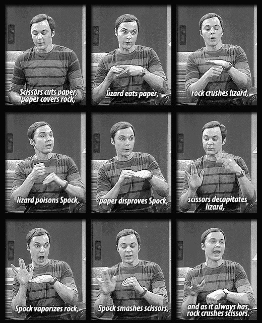

# Rock, Paper, Scissors, Lizard, Spock
A game of chance from The Big Bang Theory that expands the traditional game of Rock, Paper, Scissors. Currently, this game will be played entirely in the console.

### Rules 
---
Scissors cuts Paper  
Paper covers Rock  
Rock crushes Lizard  
Lizard poisons Spock  
Spock smashes Scissors  
Scissors decapitates Lizard  
Lizard eats Paper  
Paper disproves Spock  
Spock vaporizes Rock  
(and as it always has) Rock crushes Scissors  

