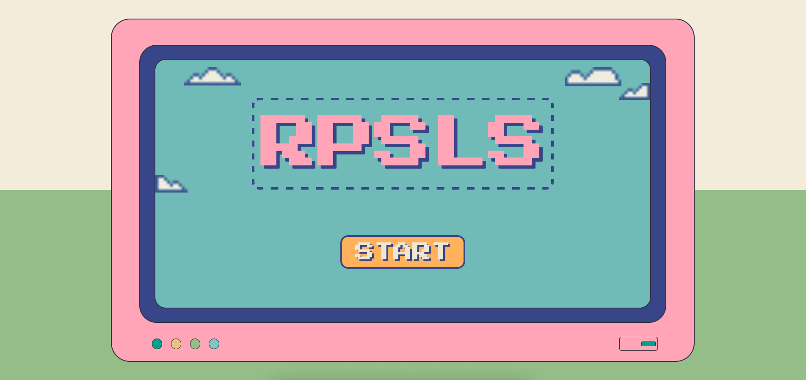
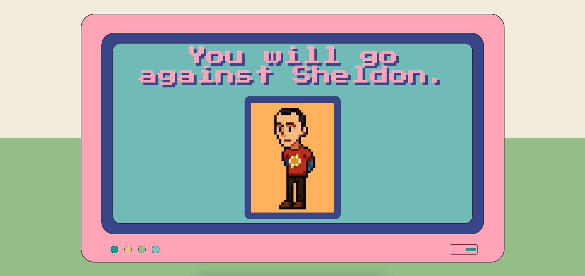
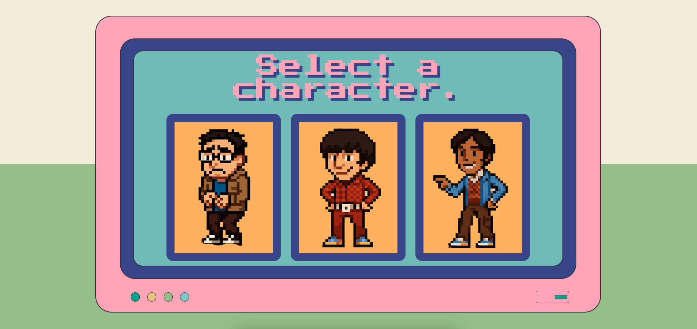
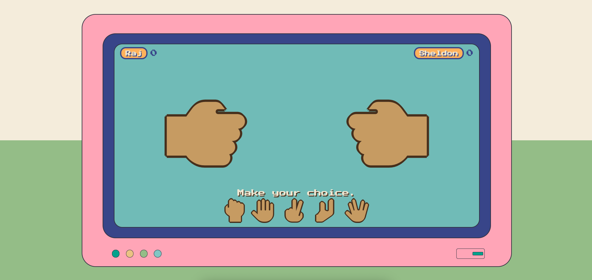

# **The Big Bang Theory: Rock, Paper, Scissors, Lizard, Spock**

This is a web-based implementation of the classic game "Rock, Paper, Scissors, Lizard, Spock," famously popularized by the TV show The Big Bang Theory. This game serves as a practical application of core web development skills, focusing heavily on DOM manipulation with vanilla JavaScript.

Players choose one of three characters (Leonard, Howard, or Raj) to face off in a battle of wits against the formidable Sheldon Cooper.

### **Live Demo**

[Rock, Paper, Scissors, Lizard, Spock](https://aquaryasss.github.io/rock-paper-scissors-lizard-spock/)

### **Features**

- Classic RPSLS Rules: "Scissors cuts paper, paper covers rock, rock crushes lizard, lizard poisons Spock, Spock smashes scissors, scissors decapitates lizard, lizard eats paper, paper disproves Spock, Spock vaporizes rock, and as it always has, rock crushes scissors."
- Play Against Sheldon: The computer opponent is styled as Sheldon Cooper.
- Choose Your Character: Play as Leonard, Howard, or Raj, each with their own unique in-game quotes.
- Dynamic Updates: Scores, round results, and game states are all updated on the fly without ever reloading the page.
- Single-Page Application Feel: Built entirely with DOM manipulation to create, update, and remove elements as needed.

### **Technologies Used**

- HTML5: For the core structure of the application.
- CSS3: For all styling, including Flexbox layouts, custom properties, and animations (@keyframes, transition).
- Vanilla JavaScript: For all game logic, state management, event handling, and extensive DOM manipulation.
- Font Awesome: For the interactive choice icons (rock, paper, scissors, etc.).
- Google Fonts: For the "Press Start 2P" pixel font used throughout the UI.

### **How to Run Locally**

1. Clone the repository:
```sh
```sh 
    git clone https://github.com/aquaryasss/rock-paper-scissors-lizard-spock.git
```  
2. Navigate to the project directory:
```sh 
    cd rock-paper-scissors-lizard-spock
```  
3. Open the `index.html` file in your web browser of choice.

### **Screenshots**






